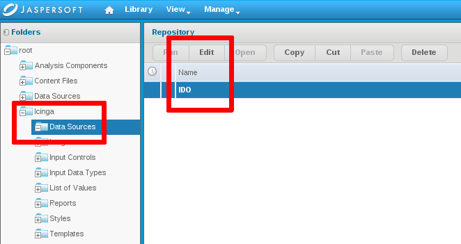
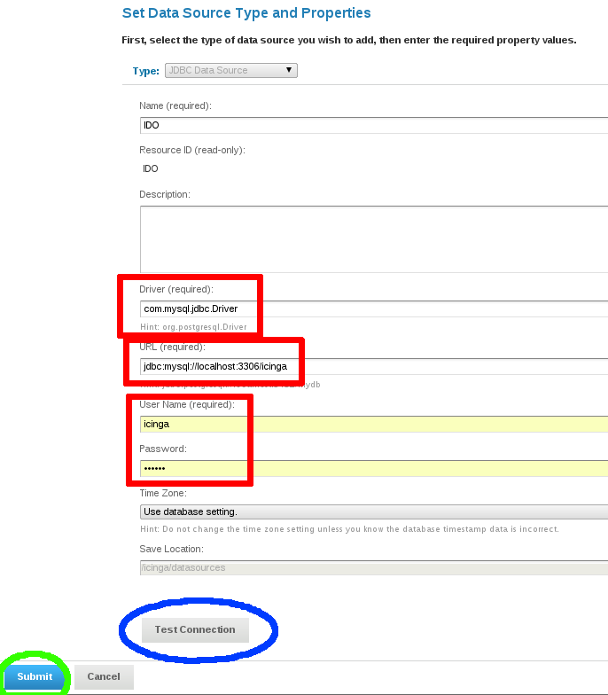

#Setting up Icinga with Reporting

These guides were written targetting **Icinga 1.x**.

You can use JAsperReporting with Icinga 2.x as well, please check the notes.

## Official Docs

For more information, please refer to the

[official install guide](http://sourceforge.net/projects/jasperserver/files/JasperServer/JasperServer%204.5.0/JasperReports-Server-CP-Install-Guide.pdf/download)

## Requirements

### IDO database as data source

The database backend will be used. 


This works the same way for **Icinga 1.x (IDOUtils)** and **Icinga 2.x (DB IDO)**. Make sure to pass the correct database name and credentials.

An additional sla procedure needs to be installed separately into the SQL schema.

#### MySQL

Import the function into your existing IDOUtils database.
	
	# mysql icinga < icinga-reports-1.8.0/sql/mysql/icinga_availability.sql

Icinga Reporting 1.9 restructured the files a bit, so choose

	# mysql icinga < icinga-reports-1.9.0/db/icinga/mysql/availability.sql

as well as make sure your db user has the correct GRANT for EXECUTE.

	GRANT EXECUTE ON icinga.* To <username>@<host>;

#### PostgreSQL

more information is coming soon... Until then follow the git master and [Dev Tracker Link](https://dev.icinga.org/issues/1880)
 

### Apache Tomcat
Only if you don't want to use the bundled one from JasperServer

	# apt-get install tomcat6

### Postgresql

Only if you don't want to use the bundled one from JasperServer. Postgresql is required for JasperServer's internal storage. You may change that back to MySQL using the provided MySQL connector and following JasperServer documentation.

### JasperServer

**Minimum supported JasperServer Version 4.5.0**
 
Depending on your architecture (uname -a), fetch the appropriate installer - below is x64

```
$ http://downloads.sourceforge.net/project/jasperserver/JasperServer/JasperReports%20Server%205.0.0/jasperreports-server-cp-5.0.0-linux-x64-installer.run

$ chmod +x jasperreports-server-cp-5.0.0-linux-x64-installer.run
$ sudo ./jasperreports-server-cp-5.0.0-linux-x64-installer.run
```

* Agree to license
* select bundled tomcat
* select bundled postgresql
* select a different postgresql port, like 5433 not to interfere with existing setups
* install sample reports and ireports

The installer will automatically create the needed database, create the schema and install samples.

The default install location will be `/opt/jasperreports-server-cp-5.0.0/` - so make sure to work on the correct jasperserver if you are doing an upgrade!


#### Start

	# /opt/jasperreports-server-cp-5.0.0/ctlscript.sh start
	
For individual components

	# /opt/jasperreports-server-cp-5.0.0/ctlscript.sh postgresql start|stop
	# /opt/jasperreports-server-cp-5.0.0/ctlscript.sh tomcat start|stop

## Icinga Reporting

As from Icinga 1.6 on, the package provides configure and make scripts.

### Sources

Either download from sourceforge and extract, or get the latest developer snapshot from git. ((Warnung) Note: Versions will differ depending on releases(Warnung))

	$ wget http://sourceforge.net/projects/icinga/files/icinga-reporting/1.9.0/icinga-reports-1.9.0.tar.gz ; tar xzf icinga-reports-1.9.0.tar.gz; cd icinga-reports-1.9.0
	
or
	
	$ git clone git://git.icinga.org/icinga-reports.git ; cd icinga-reports

If a developer told you to use his/her branch, check that out with

	$ git branch localbranch origin/devhead/devbranch
	$ git checkout localbranch
	$ git log

### Configure
if you did not install the JasperServer into the default prefix before, you need to tell configure the location.

	$ ./configure --with-jasper-server=/opt/jasperreports-server-cp-5.0.0

### Setup

Invoke 'make' without params to get a full list of available options.

#### Mysql Connector

JasperServer natively ships with the Postgresql Connector, but if you require Mysql, the Icinga Reporting package provides one for install.

	# make install-mysql-connector

Restart the Tomcat server

	# /opt/jasperreports-server-cp-5.0.0/ctlscript.sh stop tomcat
	# /opt/jasperreports-server-cp-5.0.0/ctlscript.sh start tomcat

#### Install

Jasperserver must be running!

	# make install

or as update

	# make update

Restart the Tomcat server

	# /opt/jasperreports-server-cp-5.0.0/ctlscript.sh stop tomcat
	# /opt/jasperreports-server-cp-5.0.0/ctlscript.sh start tomcat

### Configuration
Open the webinterface, default credentials are jasperadmin:jasperadmin
	
	http://127.0.0.1:8080/jasperserver

### IDO database as data source
Go to **/root/Icinga/datasource** (be sure that Refine contains "changed by anyone").

This works the same way for Icinga 1.x (IDOUtils) and Icinga 2.x (DB IDO). Make sure to pass the correct database name and credentials. 

* edit the existing datasource and configure your values.



* if needed, change the database driver plus the type, server, port, name of the database.
	* For MySQL:
		* com.mysql.jdbc.Driver
		* jdbc:mysql://localhost:3306/icinga
	* For Postgresql ((Warnung) not fully working queries)
		* org.postgresql.Driver
		* jdbc:postgresql://localhost:5432/icinga




* test the configuration and save the connection.
* all reports in our package point to this datasource and should be able to run.

## Reports

Verify the reports available and working.


## Integrate Graphs like PNP4Nagios or inGraph

You can use the existing template activityWithGraphInGivenTime.jrxml to integrate performance-graphs during reporting generation. Please set the correct graph url instead of **pnp-server-url-with-path**.


## Icinga Web Integration

This has been written in its very own guide, as it was target to change in the past. Please read on [here]().


This is fully optional: Icinga Web provides a ready to use Reporting Cronk with some nice integration, as well as scheduling :-)

## Logging

You can set the log levels via the GUI too, but they are only valid fuer the current session (and I haven't found any log window). To enable that globally, edit this file in your jasperserver install dir (i.e.`/opt/jasperreports-server-cp-5.0.0/`), and then restart the tomcat server.

```
# vim ./apache-tomcat/webapps/jasperserver/WEB-INF/log4j.properties
 
### JasperReports loggers
log4j.logger.net.sf.jasperreports.engine.query.JRJdbcQueryExecuter=debug


# ./ctlscript.sh restart
```

### Startup

There's the problem with a lot of internal and external dependencies, so you'd have to decide yourself what needs to be started for your jasperserver to be ready. The easiest way to accomplish that without an initscript will be to run a little script from rc.local which will be the last script to be run on startup.

Based on your decisions above, decide which components should be started, and which are already started systemwide!

Possible Initscript can be found in this [howto](http://mbrownnyc.wordpress.com/technology-solutions/reliability-monitoring-solution/implement-icinga-on-centos6-with-selinux/).

```
# vim /usr/local/bin/start-jasper
#!/bin/bash

cd /opt/jasperreports-server-cp-5.0.0/
./ctlscript.sh start postgresql
./ctlscript.sh start tomcat
# chmod +x /usr/local/bin/start-jasper
# vim /etc/rc.local

# start jasperserver with integrated postgresql (5433) and tomcat (8080)
/usr/local/bin/start-jasper >> /var/log/jasperserver.log 2>&1
```

## Errors

### Install Errors

If you see something like that, you should rather run `make update` instead. Or you'll remove the entire resources, and start over.

```
$ sudo make install
....
Resource /icinga/templates/sub/service/activityInGivenTime already exists, not importing
Resource /icinga/templates/sub/service/allNotificationsInGivenTime already exists, not importing
Resource /icinga/templates/sub/service/availabilityInGivenTime already exists, not importing
Resource /icinga/templates/sub/service/top10InGivenTime already exists, not importing
```

You must actually log into your Jasperreports Webinterface, and manually delete all duplicated items (or the entire icinga resources, like shown below). 


### Display Errors

	org.springframework.web.util.NestedServletException: Handler processing failed; nested exception is java.lang.InternalError: Can't connect to X11 window server using ':0' as the value of the DISPLAY variable.
	
The tomcat being run as root, trying to access the users x11 display. Allow it for everyone locally.
 	
	$ xhost +local:all
	
### Generation Errors
#### JRStyledTextParser
	org.springframework.web.util.NestedServletException: Handler processing failed; nested exception is java.lang.NoClassDefFoundError: Could not initialize class net.sf.jasperreports.engine.util.JRStyledTextParser

It could be Sun AWT trying to connect to X11 classes, but actually it's the PDF generation on a report.

	$ sudo apt-get install msttcorefonts
	$ cd /opt/jasperreports-server-cp-5.0.0
	$ sudo sh ctlscript.sh stop
	$ sudo sh ctlscript.sh start
	
#### Groovy

Starting with 4.6.0 Jasper requires [groovy](http://packages.debian.org/wheezy/groovy) to be installed as well, as [this question](http://stackoverflow.com/questions/10966257/how-to-run-jasper-report-in-servlet) shows.

#### Headless AWT Java

[Stack Overflow](http://stackoverflow.com/questions/3628302/jasperreports-noclassdeffounderror-exception-on-net-sf-jasperreports-engine-util)

```
The Sun AWT classes on Unix and Linux have a dependence on the X Window System. When you use these classes, they expect to load X client libraries and be able to talk to an X display server. This makes sense if your client has a GUI; unfortunately, it's required even if your client uses AWT but does not have a GUI (which is my case, generating a report from a web application)
The way to bypass this, is setting a system property java.awt.headless=true on system startup.
```

```
-Djava.awt.headless=true
```	

[Monitoring portal](http://www.monitoring-portal.org/wbb/index.php?page=Thread&postID=192321#post192321)

```
# vim /opt/jasperreports-5.0.0/apache-tomcat/scripts/ctl.sh 
 
"export JAVA_OPTS="-Xms1024m -Xmx1536m -XX:PermSize=32m -XX:MaxPermSize=128m -Xss2m -XX:+UseConcMarkSweepGC -XX:+CMSClassUnloadingEnabled -Djava.awt.headless=true""
 
# /opt/jasperreports-server-cp-5.0.0/ctlscript.sh stop tomcat
# /opt/jasperreports-server-cp-5.0.0/ctlscript.sh start tomcat
```
### Database Errors

**Icinga Reporting >= 1.8**

Error Message

	com.mysql.jdbc.exceptions.jdbc4.MySQLSyntaxErrorException: execute command denied to user 'icinga'@'localhost' for routine 'icinga.icinga_availability'

This is the case when the newly introduced stored procedure in Icinga Reporting 1.8 cannot be executed by the db user, due to missing GRANT on EXECUTE. 
Check & fix like

```
mysql> show grants for 'icinga'@'localhost';
+---------------------------------------------------------------------------------------------------------------+
| Grants for icinga@localhost                                                                                   |
+---------------------------------------------------------------------------------------------------------------+
| GRANT USAGE ON *.* TO 'icinga'@'localhost' IDENTIFIED BY PASSWORD '*F7EA22C777E1A8D2E1F61A2F9EBBD74FF489FF63' |
| GRANT SELECT, INSERT, UPDATE, DELETE, DROP, CREATE VIEW ON `icinga`.* TO 'icinga'@'localhost'                 |
+---------------------------------------------------------------------------------------------------------------+
2 rows in set (0.01 sec)

mysql> GRANT EXECUTE ON icinga.* TO 'icinga'@'localhost';
Query OK, 0 rows affected (0.06 sec)
```
```
mysql> show grants for 'icinga'@'localhost';
+---------------------------------------------------------------------------------------------------------------+
| Grants for icinga@localhost                                                                                   |
+---------------------------------------------------------------------------------------------------------------+
| GRANT USAGE ON *.* TO 'icinga'@'localhost' IDENTIFIED BY PASSWORD '*F7EA22C777E1A8D2E1F61A2F9EBBD74FF489FF63' |
| GRANT SELECT, INSERT, UPDATE, DELETE, DROP, EXECUTE, CREATE VIEW ON `icinga`.* TO 'icinga'@'localhost'        |
+---------------------------------------------------------------------------------------------------------------+
2 rows in set (0.00 sec)
 
mysql> flush privileges;
Query OK, 0 rows affected (0.16 sec)
```
 
Restart your Jasperserver afterwards (Warnung) (seems to have a steady connection open which does not recognize the permissions change...)

	# /opt/jasperreports-server-cp-5.0.0/ctlscript.sh restart
