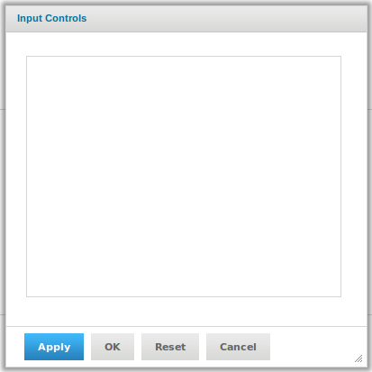
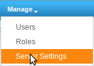
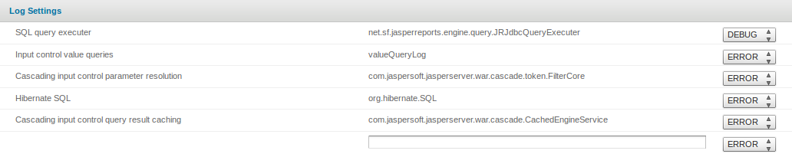

#Debugging JasperServer

If you face the problem, that your input controls in the jasper server are empty, if you run a report, then you must debug the report

To debug a report in jasper server, there are two ways to set it up.

##1. Setting up console (with restart)

Open the following file:
`/opt/jasperreports-server-cp-<version>/apache-tomcat/webapps/jasperserver/WEB-INF/log4j.properties`
and change the parameter log4j.rootLogger from:
`log4j.rootLogger=WARNING, stdout, fileout`

to:

`log4j.rootLogger=DEBUG, stdout, fileout`

Then save and restart Tomcat and then re-run the reports.

##2. Setting up web interface (without restart)

Another way is to change the configuration in the web interface. First select **Manage** -> **Server settings**

In the Log settings change the SQL query executer (net.sf.jasperreports.engine.query.JRJdbcQueryExecuter) from ERROR to DEBUG

Now you can re-run you report for debugging.

##3. JasperServer log file

`/opt/jasperreports-server-cp-<version>/apache-tomcat/webapps/jasperserver/WEB-INF/logs/jasperserver.log`
will get the parameters that are passed to the report, any stack traces (errors) and the SQL query that is generated.
