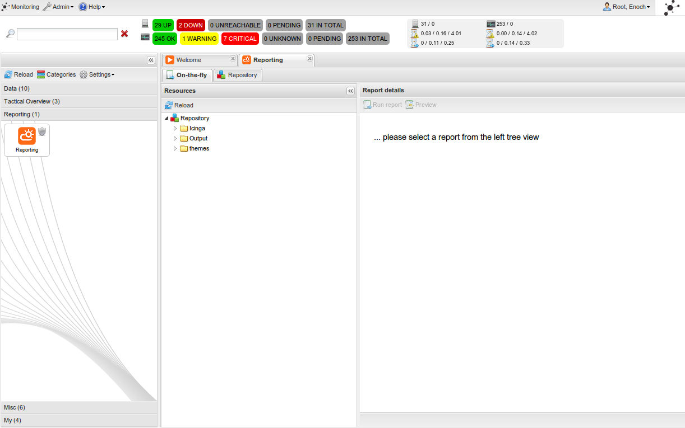
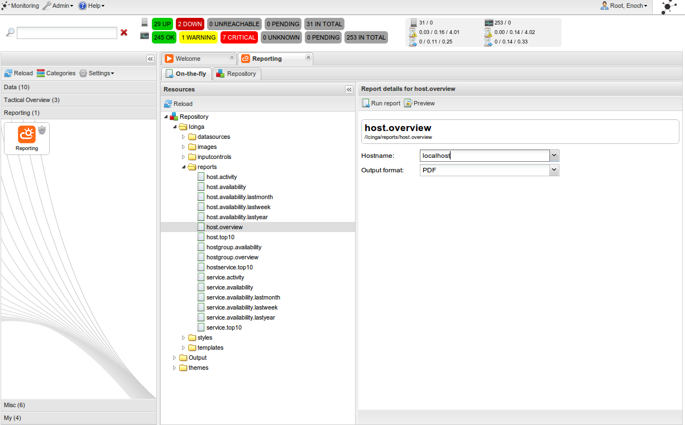
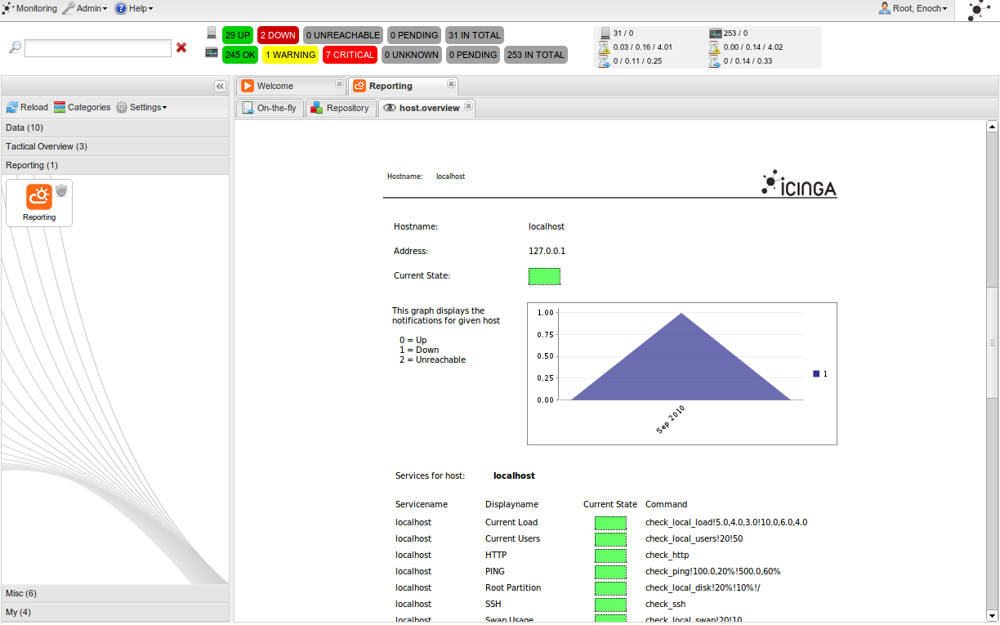

#Icinga Web Reporting Integration

## Motivation
Icinga reporting itself is made with external Jasper Server. The Jasper Server itself comes with a couple of SOAP APIs to control the whole reporting functionality remote.

## Prerequisites
To use the integration you need a fully configured icinga web environment:

* Icinga with IDOUtils up and running
* MySQL (Postgresql, Oracle currently not supported, subject to change?)
* ido2db configured and writing into the db
* Icinga Web up and running
* Icinga Reporting package installed on jasper server


**SOAP**
Communication between JasperServer and icinga-web depends on SOAP. The native PHP Soap extension is needed to get this working, like
	
	# apt-get install php-soap


## How to
### Installing

The reporting cronk is fully integrated into Icinga Web and was preinstalled into app/modules/. You do not have to install anything.


#### Debian Packages

... unless using the Debian packages, which keep them disabled by default.
Edit `/etc/icinga-web/conf.d/module_reporting.xml` and set
	
	<module enabled="true">

and clear the cache as well.

	/usr/lib/icinga-web/bin/clearcache.sh

### Configuration

Depending on your running environment you have to configure the cronk about the jasper server location and user credentials.

When **changing** the Icinga Web configuration, **always clear the cache afterwards** (look for **clearcache.sh** or **icinga-web-clearcache**)
 

#### Jasper Server Configuration

You have to set the Jasper Server URL and a valid user to connect to the SOAP API.
The configuration is written in the reporting module:


Packages will most likely use` /etc/icinga-web/conf.d` or similar to put the primary config.

`/etc/conf.d/module_reporting.xml` will be the upgrade safe location, while the original location is within `app/modules/Reporting/config/module.xml`

	# cd /path/to/icinga-web/etc/conf.d
	# vim module_reporting.xml

Since Icinga Web 1.6, reporting uses the non-capitalized tree_root with icinga while older versions used the capitalized tree_root with Icinga

```
<!-- Jasper configurations -->
<setting name="jasperconfig.default">
    <ae:parameter name="jasper_url">http://127.0.0.1:8080/jasperserver</ae:parameter>
    <ae:parameter name="jasper_user">jasperadmin</ae:parameter>
    <ae:parameter name="jasper_pass">jasperadmin</ae:parameter>
    <ae:parameter name="tree_root">/icinga/reports</ae:parameter>
</setting>
<!-- Custom config if I have more that once -->
<!--
<setting name="jasperconfig.custom1">
    <ae:parameter name="jasper_url">http://127.0.0.175/jasperserver</ae:parameter>
    <ae:parameter name="jasper_user">custom_user</ae:parameter>
    <ae:parameter name="jasper_pass">custom_passwd</ae:parameter>
    <ae:parameter name="tree_root">/icinga/reports</ae:parameter>
</setting>
-->
```

Please alter the jasperconfig.default to suites your environment and change `jasper_url`, `jasper_user` and `jasper_pass`.

##### More configurations

You can integrate more than one Jasper Server. The configuration name will be included into the reporting cronk later. Please select a unique name for other configurations.

##### Configuration names

The XML configuration is prefixed. The full name for 'jasperconfig.default' is modules.reporting.jasperconfig.default. The long name is the real config setting for using in the cronks configuration.

##### Report location in Debian

The default directory for generated reports, `/usr/app/modules/Reporting/data/tmp/`, is not correct for Debian systems. To update it, add something like

`<setting name="dir.download">/var/cache/icinga-web/reports</setting>`

to `/etc/icinga-web/conf.d/module_reporting.xml` (below <settings>) and create the directory using

`install --directory --mode=0770 --owner=www-data --group=www-data /var/cache/icinga-web/reports`


#### Cronk configuration

The jasper config is ready. Now you need a cronk and tell them which configuration you want to use

Go to your cronk configuration (`cronks.xml`)


`etc/conf.d/cronks.xml` will be the upgrade safe location for all cronks, so make sure to edit that one! (while the original location is within `app/modules/Reporting/config/cronks.xml`)

and add a new cronk like the following:
```
<ae:parameter name="icingaJasperReportingMain">
    <ae:parameter name="module">Reporting</ae:parameter>
    <ae:parameter name="action">Cronk.Main</ae:parameter>
    <ae:parameter name="hide">false</ae:parameter>
    <ae:parameter name="description">Seamless Jasper Integration</ae:parameter>
    <ae:parameter name="name">Reporting</ae:parameter>
    <ae:parameter name="categories">reporting</ae:parameter>
    <ae:parameter name="image">cronks.Weather Could Sun</ae:parameter>
    <ae:parameter name="ae:parameter">
        <ae:parameter name="jasperconfig">modules.reporting.jasperconfig.default</ae:parameter>
        <ae:parameter name="enable_onthefly">1</ae:parameter>
        <ae:parameter name="enable_repository">1</ae:parameter>
        <ae:parameter name="enable_scheduling">1</ae:parameter>
    </ae:parameter>
</ae:parameter>
```
##### Configuration names


Did you notice the configuration string `"jasperconfig"`? This is the string you configured in the `module.xml` the topic before.

You can also enable some modes for this cronk:

##### enable_onthefly

The "create reports on the fly" - mode. Allows you to create your reports in the icinga-web, taking previews and selecting your outputs etc ...


##### enable_repository

A repository view. If you have scheduled reports which create the output in the Jasper Server virtual directory. You can download Jasper resources and preview content.

##### enable_scheduling

**Disabled**
This is not enabled yet because it's not ready. You can enable the GUI in the Icinga.Reporting.Cronk to view its state. You can not save new schedules in the moment

After that, clear your cache, browse to your category the reporting is in and start to report your outages! 

#### Special User Cronk Configuration

This becomes handy, if you do not want to assign the user appkit.admin rights for accessing all the reports, but add your very own limited view on the reports.

**module_reporting.xml**

```
                    <setting name="jasperconfig.user">
                        <ae:parameter name="jasper_url">http://127.0.0.1:8080/jasperserver</ae:parameter>
                        <ae:parameter name="jasper_user">jasperadmin</ae:parameter>
                        <ae:parameter name="jasper_pass">jasperadmin</ae:parameter>
                        <ae:parameter name="tree_root">/icinga/reports</ae:parameter>
                    </setting>
```              
 
**cronks.xml**

```
            <cronk name="icingaReportingUser">
                <ae:parameter name="module">Reporting</ae:parameter>
                <ae:parameter name="action">Cronk.Main</ae:parameter>
                <ae:parameter name="hide">false</ae:parameter>
                <ae:parameter name="description">Seamless Jasper Integration</ae:parameter>
                <ae:parameter name="name">Reporting Demo</ae:parameter>
                <ae:parameter name="categories">icinga-reporting</ae:parameter>
                <ae:parameter name="image">cronks.Weather_Could_Sun</ae:parameter>
                <ae:parameter name="ae:parameter">
                    <ae:parameter name="jasperconfig">modules.reporting.jasperconfig.user</ae:parameter>
                    <ae:parameter name="enable_onthefly">1</ae:parameter>
                    <ae:parameter name="enable_repository">1</ae:parameter>
                    <ae:parameter name="enable_scheduling">1</ae:parameter>
                </ae:parameter>
            </cronk>
``` 


### Frontend
#### How to run?

Just look for the reporting cronk and drag them to your icinga tabs (I hope you configured everthing before)



#### Creating reports "on thy fly"

If you have the on tha fly mode enabled you're allowed to create your reports. Just change to the tab, select your report and choose your output format.

You can generate and dowload your file or press preview to take a look.




#### Browsing the Jasper Server repository

If you scheduled report generation the drop the output in a virtual folder change to repository view. You can explore the whole Jasper tree and examine its content.

