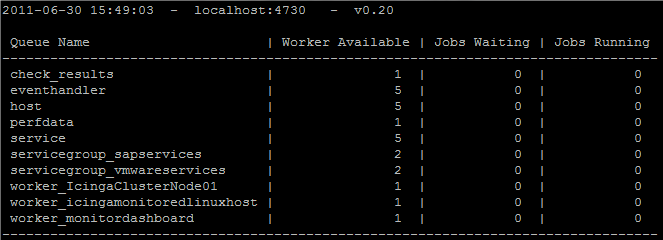

# Perfdata processing with mod_gearman and PNP

## Requirements
* PNP 0.6.12 or higher (I used 0.6.13)
* Perl module Gearman::Worker (cpan Gearman::Worker)
* Perl module Crypt::Rijndael (aptitude install libcrypt-rijndael-perl)
* A working icinga and mod_gearman installation (see Icinga Install Guides Collection and
* Setting up mod gearman with Icinga )
* **process_performance_data=1 in your main icinga.cfg**

## PNP Installation
To install PNP enter the following lines in case of icinga (--prefix is optional)

```
./configure --prefix=/path/to/pnp/installation --with-nagios-user=icinga --with-nagios-group=icinga
make all
make fullinstall
```

## Configuration

### PNP
Edit the PNP process_perfdata.cfg and edit the following directives

```
vi /path/to/pnp/installation/etc/process_perfdata.cfg
GEARMAN_HOST = localhost:4730
ENCRYPTION = 0 (i don't use encryption in mod_gearman if you do - you just have to change the KEY variable)
```

### mod_gearman
Edit the config file you use in the mod_gearman broker_module directive in main icinga config file icinga.cfg

```
broker_module=/path/to/mod_gearman/lib/mod_gearman/mod_gearman.o config=/path/to/mod_gearman/etc/mod_gearman_local.conf
```

Edit the file

```
vi /path/to/mod_gearman/etc/mod_gearman_local.conf

change perfdata=no to perfdata=yes
```

to activate perfdata processing to gearmand

**Remove any existing PNP configuration like npcdmod.o from icinga.cfg and stop npcd if running**

Restart icinga then restart gearmand

```
/etc/init.d/icinga restart
/etc/init.d/gearmand restart
```

Then check with gearman_top if there is a queue named perfdata appearing and if its "jobs waiting" queue is increasing




Then start your pnp_gearman worker

```
/etc/init.d/pnp_gearman_worker start
```

That's it.
