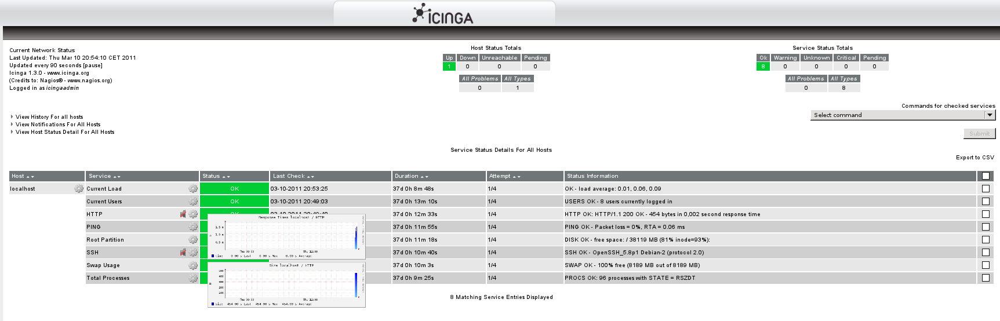
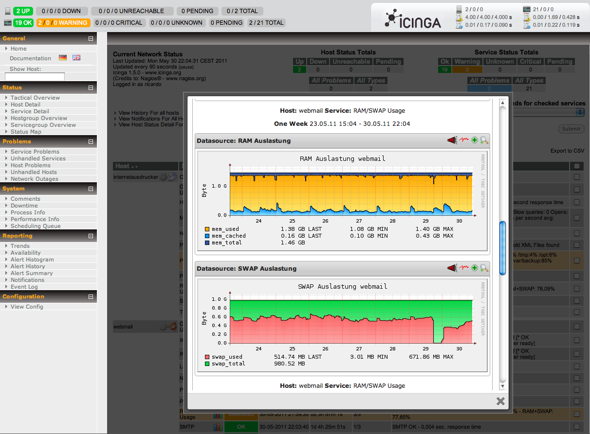

# PNP4Nagios in Classic-UI

## Integration into Classic-UI

### PNP Urls
By default, the [config.php option nagios_base](http://docs.pnp4nagios.org/pnp-0.6/webfe_cfg) points to the wrong location, linking the wrong cgis.

Change that accordingly to your relative cgi path, like

```
$conf['nagios_base'] = "/icinga/cgi-bin";
```

### Default Popups

#### action_url templates
Note: Make sure you'll include this file in your icinga.cfg as cfg_file or cfg_dir directive.

```
# vim /usr/local/icinga/etc/pnptemplate.cfg

define host {
        name       pnp-hst
        register   0
        action_url /pnp4nagios/graph?host=$HOSTNAME$' class='tips' rel='/pnp4nagios/popup?host=$HOSTNAME$&srv=_HOST_
}

define service {
        name       pnp-svc
        register   0
        action_url /pnp4nagios/graph?host=$HOSTNAME$&srv=$SERVICEDESC$' class='tips' rel='/pnp4nagios/popup?host=$HOSTNAME$&srv=$SERVICEDESC$
}
```

and use those templates in your host and service templates, e.g.

```
define host{
        name                            generic-host
        use                             pnp-hst
...

define service{
        name                            generic-service
        use                             pnp-svc
...
```

#### SSI Header File
During 'make all', the status-header.ssi has been prepared to be read-only.

```
chmod a+r ./contrib/ssi/status-header.ssi
```

We need to copy that into Icinga's share/ssi directory

```
# cp contrib/ssi/status-header.ssi /usr/local/icinga/share/ssi/status-header.ssi
```

or create it yourself.

```
# vim /usr/local/icinga/share/ssi/status-header.ssi

<script src="/pnp4nagios/media/js/jquery-min.js" type="text/javascript"></script>
<script src="/pnp4nagios/media/js/jquery.cluetip.js" type="text/javascript"></script>
<script type="text/javascript">
jQuery.noConflict();
jQuery(document).ready(function() {
  jQuery('a.tips').cluetip({ajaxCache: false, dropShadow: false,showTitle: false });
});
</script>


# chmod 644 /usr/local/icinga/share/ssi/status-header.ssi
```



#### iFrame
This is what it looks like.



##### What do we need
FancyBox 1.3.4 [http://fancybox.net ]

##### Setting up ColorBox
Let's assume you installed Icinga in **/usr/local/icinga/**

1. Download FancyBox!
2. create a dir /usr/local/icinga/share/fancybox
3. copy **jquery.fancybox-1.3.4.pack.js** to this folder
4. also copy **jquery.fancybox-1.3.4.css** to the fancybox folder
5. copy the png images to the fancy box folder

Installing ColorBox would look like this:

```
wget http://fancybox.googlecode.com/files/jquery.fancybox-1.3.4.zip
unzip jquery.fancybox-1.3.4.zip

mkdir -p /usr/local/icinga/share/fancybox

cp jquery.fancybox-1.3.4/fancybox/jquery.fancybox-1.3.4.pack.js /usr/local/icinga/share/fancybox/
cp jquery.fancybox-1.3.4/fancybox/jquery.fancybox-1.3.4.css /usr/local/icinga/share/fancybox/
cp jquery.fancybox-1.3.4/fancybox/*.png  /usr/local/icinga/share/fancybox/

chown -R icinga.icinga /usr/local/icinga/share/fancybox

chmod 755 /usr/local/icinga/share/fancybox
chmod 644 /usr/local/icinga/share/fancybox/*
```


##### Preparing SSI Header
create common-header.ssi (for fancybox-1.3.x)

```
# vim /usr/local/icinga/share/ssi/common-header.ssi

<link media="screen" rel="stylesheet" href="/icinga/fancybox/jquery.fancybox-1.3.4.css" />
<script src="/icinga/fancybox/jquery.fancybox-1.3.4.pack.js"></script>
<script>
        $(document).ready(function(){
                $(".pnp4nagios").fancybox({
                    speedIn:200,
                    speedOut:100,
                    type:"iframe",
                    width:680,
                    height:600,
                    centerOnScroll:true,
                    overlayOpacity:0.7,
                    overlayColor:'black',
                    onStart:function() { icinga_stop_refresh(); },
                    onClosed:function() { icinga_start_refresh(); }
                });
        });
</script>

# chmod 644 /usr/local/icinga/share/ssi/common-header.ssi
```

create common-header.ssi (for fancybox-2.x.x)

```
# vim /usr/local/icinga/share/ssi/common-header.ssi

<link media="screen" rel="stylesheet" href="/icinga/fancybox/jquery.fancybox-2.X.X.css" />
<script src="/icinga/fancybox/jquery.fancybox-2.X.X.pack.js"></script>
<script>
        $(document).ready(function(){
                $(".pnp4nagios").fancybox({
                   type:"iframe",
                    fitToView: false,
                    autoSize:false,
                    width:650,
                    height:"95%",
                    openEffect:'elastic',
                    closeEffect:'elastic',
                    onStart:function() { icinga_stop_refresh(); },
                    onClosed:function() { icinga_start_refresh(); }
                });
        });
</script>

# chmod 644 /usr/local/icinga/share/ssi/common-header.ssi
```

##### adding template
Note: Make sure you'll include this file in your icinga.cfg as cfg_file or cfg_dir directive.

```
# vim /usr/local/icinga/etc/pnptemplate.cfg

define service {
        name         perf_link
        register     0
        icon_image   ../empty.gif' width='0' height='0' border='0'></a><a href='/pnp4nagios/index.php/graph?host=$HOSTNAME$&srv=$SERVICEDESC$&version=tiny' class='pnp4nagios'></a><a href='/pnp4nagios/graph?host=$HOSTNAME$&srv=_HOST_' class='tips' rel='/pnp4nagios/popup?host=$HOSTNAME$&srv=_HOST_'></a><a href='/pnp4nagios/graph?host=$HOSTNAME$&srv=_HOST_' class='tips' rel='/pnp4nagios/popup?host=$HOSTNAME$&srv=_HOST_'></a><a href='/pnp4nagios/graph?host=$HOSTNAME$&srv=_HOST_' class='tips' rel='/pnp4nagios/popup?host=$HOSTNAME$&srv=_HOST_'></a><a href='/pnp4nagios/graph?host=$HOSTNAME$&srv=$SERVICEDESC$' class='tips' rel='/pnp4nagios/popup?host=$HOSTNAME$&srv=$SERVICEDESC$'><img width='20' height='20' src='/icinga/images/logos/Stats2.png' border='0" , ALL_HOSTS, [""] )
]
```

###### extinfo.cgi
The proper usage of icon_image can also be shown in other CGIs - the extended host and service information pages for example.

And even if you want to add the JS popup, you just need to make sure the cgis load the correct SSI (copy status-header.ssi into extinfo-header.ssi)


```
(example from debian package install)
# cd /usr/share/icinga/htdocs/ssi/
# cp status-header.ssi extinfo-header.ssi
```
