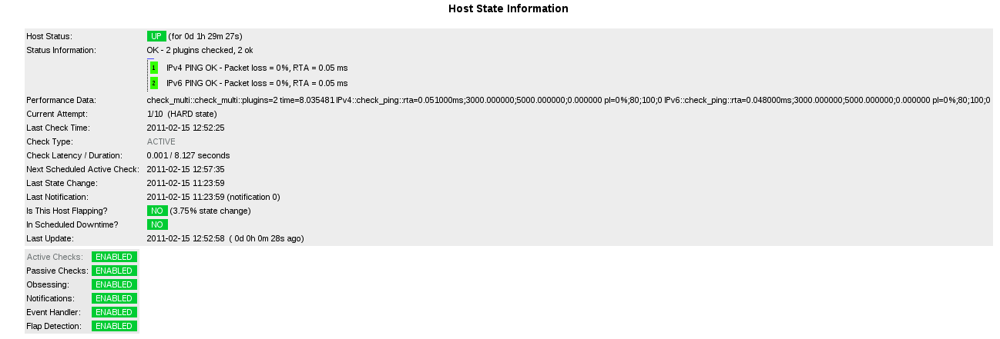

# Dualstack (IPv4, IPv6) monitoring with Icinga

## Purpose
Icinga 1.3.0 includes address6 as host attribute next to address. So in order to monitor the host, there are 2 different addresses in case you don't happen to use the host name instead.

**Info:** Another pleasant method would be using a plugin wrapper like [check_v46](01_12_03_check_v46.md) from Funet.

## Dualstack Host Address Checks
Having IPv4 and IPv6 addresses assigned to the host, it comes to mind that the normal check command for the host should support both IP addresses to be used within a check.

Of course, you might assign service definitions to the host, using the different macros

* $HOSTADDRESS$
* $HOSTADDRESS6$

and creating check commands with those (e.g. check_ping for IPv4 and IPv6).

But it's also worthwile to think about dualstacked monitoring, passing both addresses to a single host check and create conditions, which state will be returned.


### check_multi
Matthias Flacke created [check_multi](http://my-plugin.de/wiki/projects/check_multi/start) which basically supports multiple checks within a single check command. In this use case, it's logically to use that to execute two host checks and decide upon the return values on the overall returned hostcheck state.


#### Installation
Download check_multi, put it into the location of $USER1$ defined in resource.cfg

```
$ git clone git://github.com/flackem/check_multi ; cd check_multi
$ ./configure --with-nagios-name=icinga --with-nagios-user=icinga --with-nagios-group=icinga
$ make all
$ sudo make install
```

Using Debian packages it's more easy - having backports enabled from [Setting up Icinga with IDOUtils on Debian](../installation-guides/01_01_setting_up_icinga_with_idoutils_on_debian.md)

```
# apt-get install nagios-plugin-check-multi
```

#### Configuration
Define check_multi check commands in order to use them afterwards. It is necessary to tell check_multi which macros should be used and piped into. We are also using a default path for all expected `*.cmd` files ($ARG1$).

**Info:** Debian packages: /usr/lib/nagios/plugins/check_multi

```
define command {
  command_name         check_multi
  command_line         /usr/local/icinga/libexec/check_multi -l /usr/local/icinga/libexec -s HOSTADDRESS=$HOSTADDRESS$ -s HOSTADDRESS6=$HOSTADDRESS6$ -f /usr/local/icinga/etc/$ARG1$ $ARG2$ $ARG3$ $ARG4$
}
```

The host definition takes the check_multi cmd file and the output parameters.


```
define host{
        use                     linux-server-v6
        host_name               localhostv6
        alias                   localhostv6
        address                 127.0.0.1
        address6                ::1
        check_command           check_multi!check_multi_host_dualstack.cmd -r 1+2+4+8
        }
```

Define the check commands for IPv4 and IPv6 and the conditions how the return state will be (this is up to you!).


```
# vim /usr/local/icinga/etc/check_multi_host_dualstack.cmd

command[ IPv4 ]         = check_ping -4 -H $HOSTADDRESS$ -w 3000.0,80% -c 5000.0,100% -p 5
command[ IPv6 ]         = check_ping -6 -H $HOSTADDRESS6$ -w 3000.0,80% -c 5000.0,100% -p 5

state   [ CRITICAL   ] = COUNT(CRITICAL) > 1
state   [ WARNING    ] = COUNT(WARNING) > 0 || COUNT(CRITICAL) > 0
state   [ UNKNOWN    ] = COUNT(UNKNOWN) > 1
```

The result will look like that (cgi.cfg:escape_html_tags=0)


