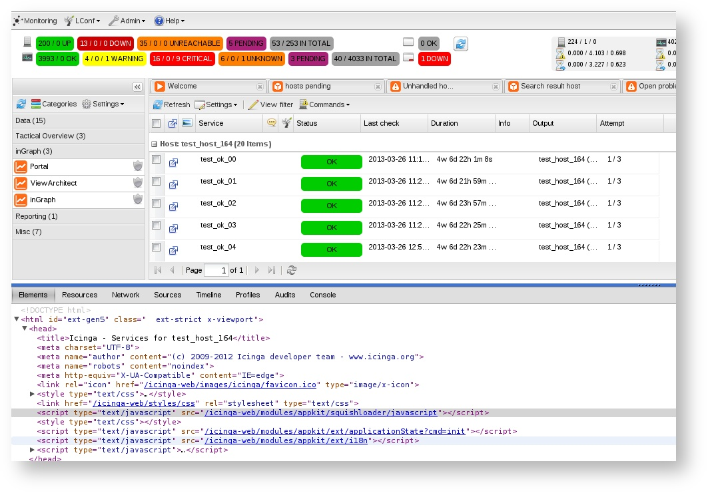
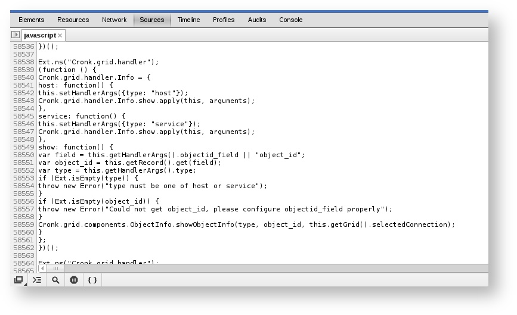
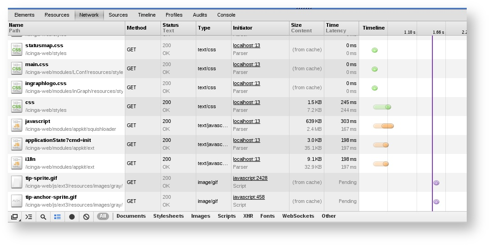
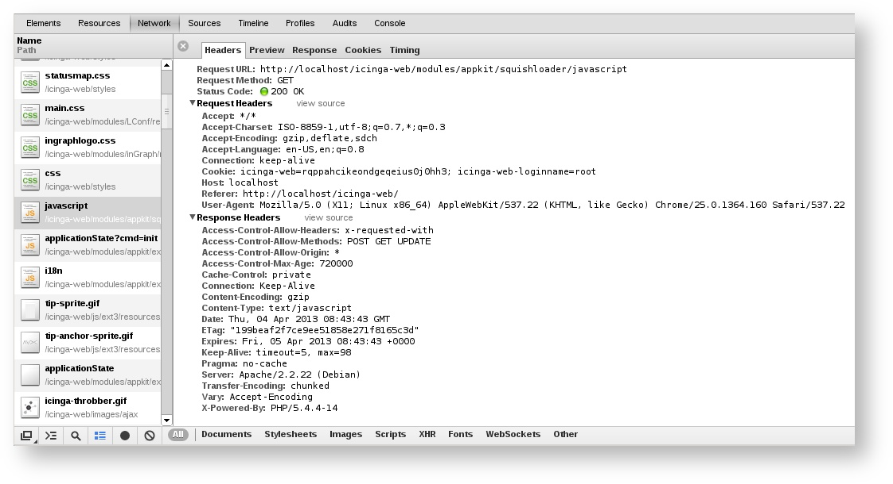
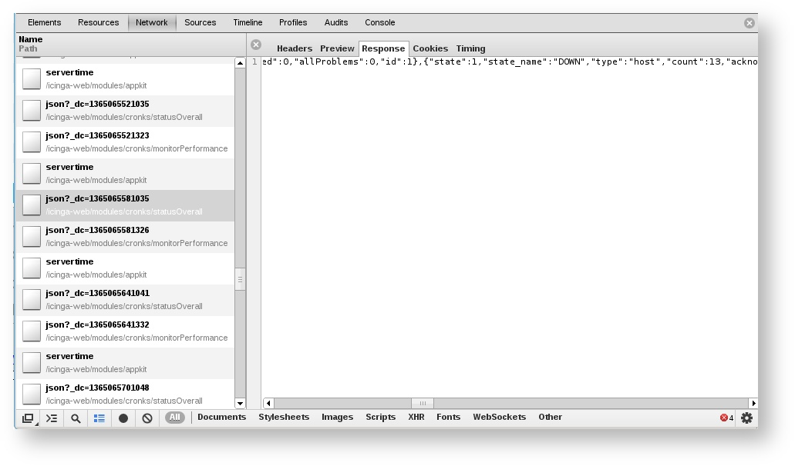
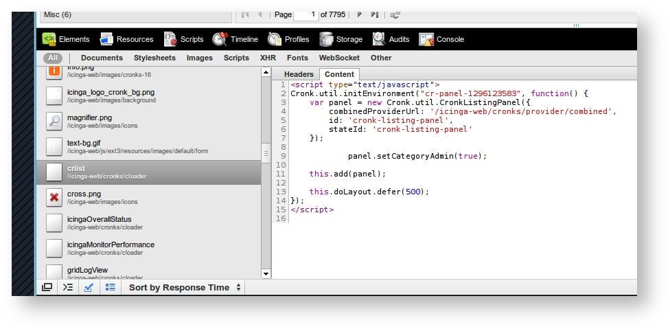
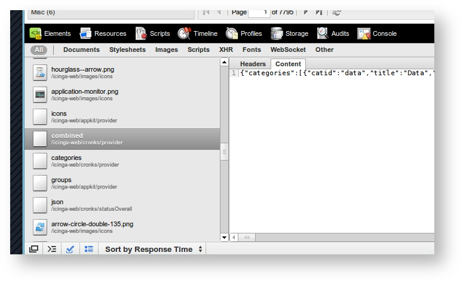
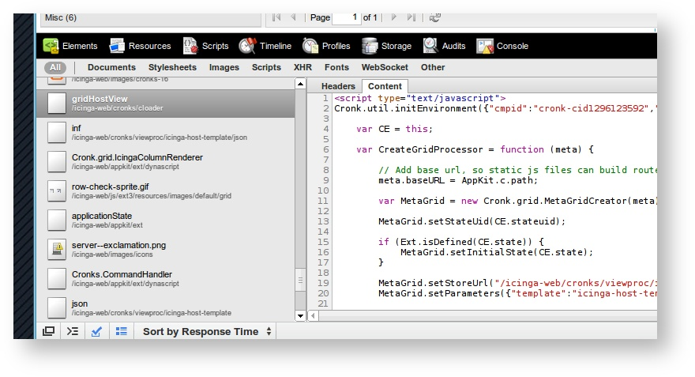
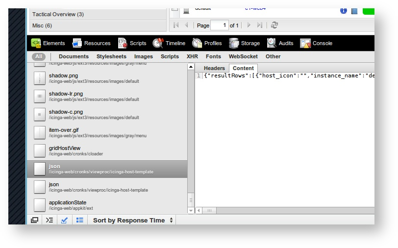
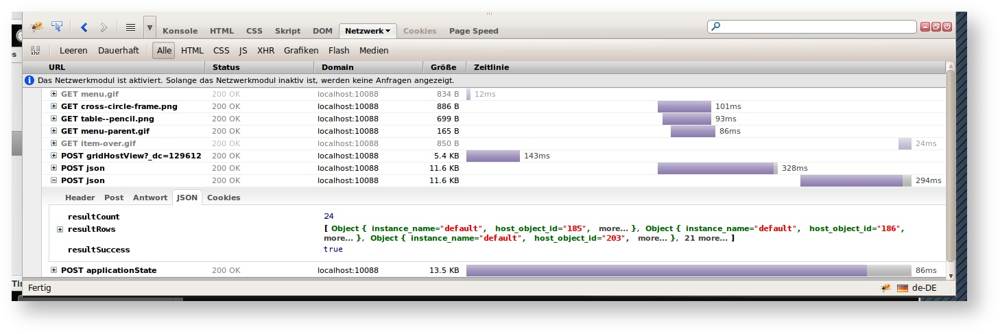

#Icinga Web Testing
**This guide was written for Icinga Web 1.x only.**
##Icinga Web Tests
In order to test Icinga web, make sure you have installed the following

* Icinga Core
* Icinga IDOUtils as datasource
* Icinga Web backend with configured datasource (**databases.xml**)


There are different setup methods of Icinga Web. **This testing guide focuses on "everything is installed on the same box"**.

If you happen to have a **different (distributed) setup**, like

* HostA - Icinga Core, IDOUtils
* HostB - IDOUtils Database
* HostC - Icinga Web

make sure to test the remote connectivity as well, respectively do the proposed tests of the components on the hosts where they are actually installed.
Furthermore, remote Icinga Web requires: **a.)** IDOUtils database access (**databases.xml**) and **b.)** Icinga Core Command Pipe access (**access.xml**) 

### Test - but what exactly?

**Icinga API has been deprecated since 1.5** [Farewell Icinga API](https://www.icinga.org/2011/08/05/farewell-icinga-api/)

The Icinga Web fetches its data from the internal Doctrine DB abstraction layer, on the default setup this data is being written through Icinga IDOUtils from the Core into a RDBMS. So there's a bunch of testing and getting it to work in the other sections too before stepping over here ;-)

**if you came here because someone wanted you to follow these steps, please provide him/her the output as well!!!**

### Check Configuration
* the **databases.xml** contains the correct configuration for
	* icinga-web database (internal config, session db)
	* icinga idoutils database (backend data db, mysql, pgsql or oracle)
* database connection for icinga_web and icinga tables is working
* all required dependencies are installed? - make testdeps
* use syntax highlighting to see if everything is filled correctly 


#### Database versions
make sure you did all upgrades, and use the db versions corresponding with your db schema

```
#> use icinga_web;
#> select * from nsm_db_version;

#> use icinga;
#> select * from icinga_dbversion;
```

### Database Connection
* local

```
# mysql icinga -u icinga -p
# su - postgres -c 'psql -d icinga -U icinga'
# sqlplus icinga/icinga@XE
```

* remote

```
# mysql icinga -h yourremoteicingahost -u icinga -p
# su - postgres -c 'psql -d icinga -h yourremoteicingahost -U icinga'
# sqlplus icinga/icinga@//yourremoteicingahost/XE
```

### No Data
All locations refer to packages. If you have different file locations, please adapt the given paths from your installation documentation.

**Choose whether Icinga 1.x or 2.x is used!!!**

#### Icinga 2.x


##### Verify that DB IDO is enabled
Verify that DB IDO is enabled
Example: MySQL.

```
# icinga2-enable-feature ido-mysql
 
# /etc/init.d/icinga2 restart
```

##### Verify the database credentials

```
# vim /etc/icinga2/features-enabled/ido-mysql.conf
```

##### Check the Icinga 2 log

```
# tail -f /var/log/icinga2/icinga2.log
```

#### Icinga 1.x
##### Verify that [Icinga IDOUtils]() is operational


If asked provide the configuration files of idomod.cfg and ido2db.cfg for example using this command (adjust /etc to your possible prefix)
````
# find /etc -type f -name 'ido???.cfg'| xargs egrep -v "^$|^#"
```

* idomod and ido2db socket type and location must match!

```
/etc/icinga/idomod.cfg:output_type=unixsocket
/etc/icinga/idomod.cfg:output=/var/icinga/ido.sock
 
/etc/icinga/ido2db.cfg:socket_type=unix
/etc/icinga/ido2db.cfg:socket_name=/var/icinga/ido.sock
```

* idomod loaded, see syslog/icinga.log

```
# cat /var/log/messages | grep ido | less
# cat /var/log/messages | grep icinga | less
```

* verify that idomod is connected via socket to ido2db - check running processes and count the number.

```
# ps aux | grep ido2db | grep -v grep | wc -l
```

* must be equal to 2 (1 parent, 1 connected idomod)
* if not - check logs, debug logs for data inserts - see Icinga IDOUtils Testing for log location

**Using Debian/Ubuntu packages, check that ido2db is set to 'yes' in /etc/default/icinga**

* verify that idomod is enabled in your configuration
 

You can enable **idomod** using the module definition **OR** icinga.cfg:broker_module.
Make sure that there's only **one** enabled, and not 2 modules racing for performance!
**After enabling, restart Icinga Core to load idomod**. Check that via syslog, ido2db will tell when idomod is successfully connected! (example see below)

```
# grep broker_module /etc/icinga/icinga.cfg
# grep modules /etc/icinga/icinga.cfg
# grep idomod /etc/icinga/modules/idoutils.cfg
```
 


##### Check IDO DB

* Check the credentials defined in [databases.xml]()
* login via shell client, or similar

```
# mysql -u <icingauser> -p <icingadb>
Enter Password: <icingapass>
```
 
* check status, config tables - [DB Model](http://docs.icinga.org/latest/en/db_model.html)

**More data integrity tests can be found here:** [Special IDOUtils Queries]()
 
* make sure the data is available
	* see sections **Configs** and **Status** below


##### check if idomod is connected

* ido2db will log to syslog when a client is connected

```
# cat /var/log/messages | grep ido2db
 
Apr 19 14:06:10 icinga-dev ido2db: Client connected, data available.
Apr 19 14:06:10 icinga-dev ido2db: Handling client connection...
Apr 19 14:06:10 icinga-dev ido2db: Successfully connected to mysql database
```

* ido2db will insert a successful connection attempt from idomod into the conninfo table.

```
mysql> select * from icinga_conninfo order by connect_time desc limit 2;
``` 

* If that data is not updated, make sure idomod is loaded into the Core (check syslog, icinga.log for idomod entries - more above)!

```
# cat /var/log/messages | grep ido | less
# cat /var/log/messages | grep icinga | less
```
```
# grep broker_module /etc/icinga/icinga.cfg
# grep modules /etc/icinga/icinga.cfg
# grep idomod /etc/icinga/modules/idoutils.cfg
```

##### check that ido2db processes data

* set debug_level=-1 in ido2db.cfg and restart ido2db and icinga (in this order)

```
# vim /etc/icinga/ido2db.cfg 
debug_level=-1 
# service ido2db restart
# service icinga restart
``` 

* tail the debug log file (location in ido2db.cfg)

```
# tail -f /var/log/icinga/ido2db.debug
``` 

#### Check Icinga Web logs
* check icinga-web/log/* for logs, increase debug levels, and post that demanding you to

```
# less /var/log/icinga-web/icinga-web-2013-03-26.log
# less /var/log/icinga-web/debug-2013-03-26.log
``` 

In this example, <!-- TEXT --> must be removed within XML Syntax (Tip: use vim and :set syntax on) in order to enable the settings, below the SQL Queries are enabled to get the full queries Icinga Web is executing on specific views.

```
# vim /etc/icinga-web/module_appkit.xml


            <!-- Overwrite debuglog handling(verbosy) -->
            <settings>
                <!-- Ajax default request timeout (ms), 4 minutes == 240000 -->
                <setting name="ajax.timeout">240000</setting>
                <setting name="debug.verbose">
                    <!--  Debug output for db queries -->
                    
            <ae:parameter>API_Views_ApiDQLViewModel</ae:parameter>
                    
                    <!-- 
            <ae:parameter>Api_Store_LegacyLayer_IcingaApiModel</ae:parameter>
                    -->
                    <!--  Debug output for object search -->
                    <!-- 
                    <ae:parameter>Cronks_System_ObjectSearchResultModel</ae:parameter>
                    -->
                    <!-- Debug output for Session handling via Doctrine-->
                    <!-- 
                    <ae:parameter>AppKitDoctrineSessionStorage</ae:parameter>
                    -->
                </setting>
            </settings>

# /usr/share/icinga-web/bin/clearcache.sh
```
#### Example log of Icinga with IDOUtils starting correctly

**(versions and locations may differ)**

	Apr 19 14:06:10 icinga-dev icinga: Icinga 1.7.0-dev starting... (PID=400)
	Apr 19 14:06:10 icinga-dev icinga: Local time is Thu Apr 19 14:06:10 CEST 2012
	Apr 19 14:06:10 icinga-dev icinga: LOG VERSION: 2.0
	Apr 19 14:06:10 icinga-dev icinga: idomod: IDOMOD 1.7.0-dev (03-01-2012) Copyright(c) 2005-2008 Ethan Galstad, Copyright(c) 2009-2012 Icinga Development Team (https://www.icinga.org)
	Apr 19 14:06:10 icinga-dev icinga: idomod: Successfully connected to data sink.  0 queued items to flush.
	Apr 19 14:06:10 icinga-dev ido2db: Client connected, data available.
	Apr 19 14:06:10 icinga-dev icinga: Event broker module '/usr/lib/idomod.so' initialized successfully.
	Apr 19 14:06:10 icinga-dev ido2db: Handling client connection...
	Apr 19 14:06:10 icinga-dev ido2db: Successfully connected to pgsql database
	Apr 19 14:06:11 icinga-dev icinga: Finished daemonizing... (New PID=434)
	Apr 19 14:07:54 icinga-dev icinga: Event loop started...
	Apr 19 14:11:10 icinga-dev ido2db: Successfully connected to pgsql database
 

### Configs
* it's essential that a config object is marked as is_active=1 in the objects table
* table joins are needed as this information is stored in 2 tables
* replace **yourhostname** and **yourservicedesc** with your current configuration object names

```
mysql> select * from icinga_hosts join icinga_objects on host_object_id=object_id where name1='yourhostname' and is_active=1;

mysql> select * from icinga_services join icinga_objects on service_object_id=object_id where name1='yourhostname' and name2='yourservicedesc' and is_active=1;
``` 

* by instance name, if using multiple satellites
* replace **yourinstancename** with the one you defined in idomod.cfg (instance_name=...)

```
mysql> select count(*) from icinga_hosts
join icinga_objects on icinga_hosts.host_object_id=icinga_objects.object_id 
join icinga_instances on icinga_hosts.instance_id=icinga_instances.instance_id 
where icinga_instances.instance_name='yourinstancename' and icinga_objects.is_active=1;
```

### Status

* join objects, configs, status tables as icinga web would do
* Active Host Status by **yourhostname**
```
mysql> select *
from icinga_hosts
join icinga_objects
on icinga_hosts.host_object_id=icinga_objects.object_id
join icinga_hoststatus
on icinga_hoststatus.host_object_id=icinga_objects.object_id
where icinga_objects.name1='yourhostname'
and icinga_objects.is_active=1;
``` 
* Active Service Status by **yourhostname** and **yourservicedesc**
```
mysql> select * 
from icinga_servicestatus 
join icinga_services 
on icinga_servicestatus.service_object_id=icinga_services.service_object_id 
join icinga_objects 
on icinga_services.service_object_id=icinga_objects.object_id 
where icinga_objects.name1='yourhostname' and icinga_objects.name2='yourservicedesc'
and icinga_objects.is_active=1;
``` 
* Program Status by **yourinstancename**
```
mysql> select * 
from icinga_programstatus join icinga_instances 
on icinga_programstatus.instance_id=icinga_instances.instance_id 
where instance_name='yourinstancename';
```

**More data integrity tests are collected here:** [Special IDOUtils Queries]()

### Debugging
#### General information

Read further in the following sections Developing cronks for:

* Icinga-Web
* Developing modules for Icinga-Web
* Icinga-Web REST API
* Insider Tips
* Portability
* XML Cronk templates

Recent versions of Internet Explorer, Chrome, Firefox, etc provide developer tools and consoles which will help on debugging the ajax responses.

#### Debug Logging

Within **module_appkit.xml** you can override the debug verbosity settings. By default, you won't see any details, like database queries. In order to change that, edit the file and enable the following

                <setting name="debug.verbose">
                    <!--  Debug output for db queries -->
                    <ae:parameter>API_Views_ApiDQLViewModel</ae:parameter>
                </setting>
             

**Don't forget to clear the cache after modifying the config settings!**

#### Analyse the logs

* Always check the webserver's log file
* Check icinga-web log and debug file (default located in logs/)
* Check if really all dependencies are met - make testdeps
* Make sure, Icinga Core Testing, Icinga IDOUtils Testing are ok
* stumble through the code watching out for the function/file mentioned in the webserver log

#### ExtJS and Squishloader Debug
Squishloader basically collects the included javascript files and pushes them to the browser. This includes the base icinga web javascript as well as installed addons requiring their very own (e.g. inGraph or LConf Web).

	app/modules/AppKit/config/javascript.xml


The ExtJS javascript include may be compressed and unreadable. In order to load the debug version, make sure that there's something like this in your javascript.xml - if you have ext-**all.js**, replace it with **ext-all-debug.js** and clear your config cache.

            <!-- ExtJS base files -->
            <ae:parameter>%core.root_dir%/lib/ext3/adapter/ext/ext-base.js</ae:parameter>
            <ae:parameter>%core.root_dir%/lib/ext3/ext-all-debug.js</ae:parameter>
            <ae:parameter>%core.root_dir%/lib/ext3/examples/ux/PagingMemoryProxy.js</ae:parameter>


#### Debug Requests and Responses
It's not only the javascript, css, images, etc to be loaded from the browser, but also the actual data queries are requested via ajax handlers where json data is returned from the webserver. More on that in the next chapter.

For the basics (mostly important javascript, make sure to check for 404s as well as their reponses.


**Click on the Name to open the details about the headers and reponses**


#### Debug the Cronks
The Cronks are started through a sub request which provides Javascript. The cronk itsself initiates a data request (JSON). If something goes wrong (exception e.g.) you'll see nothing or an exception output. Maybe the sub request exists with HTTP 500.

* open /icinga-web/cronks/provider/combined as url and check for
	* JS errors
	* DB errors
	* other errors

There have been changes in newer Icinga Web versions, where different data providers are available, e.g.

* **monitorPerformance** - Performance Cronk
	* [http://localhost/icinga-web/modules/cronks/monitorPerformance/json](http://localhost/icinga-web/modules/cronks/statusOverall/json)
* **statusOverall** - Status Cronk
	* [http://localhost/icinga-web/modules/cronks/statusOverall/json](http://localhost/icinga-web/modules/cronks/statusOverall/json)
* **viewproc** - Grid Templates
	* [http://localhost/icinga-web/modules/cronks/viewproc/icinga-service-template/json](http://localhost/icinga-web/modules/cronks/viewproc/icinga-service-template/json)
	* [http://localhost/icinga-web/modules/cronks/viewproc/icinga-host-template/json](http://localhost/icinga-web/modules/cronks/viewproc/icinga-host-template/json)
	* basically all valid .xmls in **app/modules/Cronks/data/xml/grid/**
* **staticContent** - Tactical Overview
	* [http://localhost/icinga-web/modules/cronks/staticContent/icinga-tactical-overview-template-charts/content](http://localhost/icinga-web/modules/cronks/staticContent/icinga-tactical-overview-template-charts/content)
* basically all valid .xmls in **app/modules/Cronks/data/xml/to/**


##### Chrome / Chromium
Right click somewhere in Icinga-Web, choose 'inspect element'.
Click on 'Resources' and 'Enable resource tracking'.

**Cronk Request**



**Grid Request**



##### Firefox / Firebug

## Found something?
Then please let us know: [Create an Issue]()
## What else?
Next to Icinga Core there are projects in Icinga, which needs to be tested altogether then.
Have a look into
[Icinga Core Testing]()

[Icinga IDOUtils Testing]()

[Icinga Doc Testing]()


